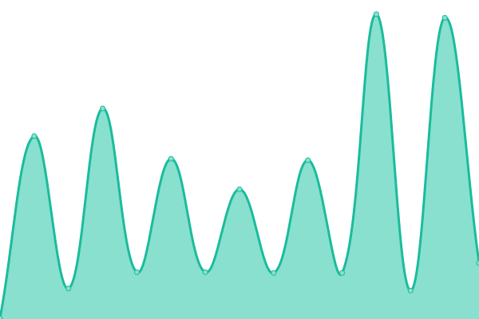

# [📈 Live Status](https://ravyshankar.github.io/website-operations): <!--live status--> **🟩 All systems operational**

This repository contains the open-source uptime monitor and status page for [RAVI SHANKAR](https://ravyshankar.github.io/website-operations), powered by [Upptime](https://github.com/upptime/upptime).

With [Upptime](https://upptime.js.org), you can get your own unlimited and free uptime monitor and status page, powered entirely by a GitHub repository. We use [Issues](https://github.com/ravyshankar/website-operations/issues) as incident reports, [Actions](https://github.com/ravyshankar/website-operations/actions) as uptime monitors, and [Pages](https://ravyshankar.github.io/website-operations) for the status page.

<!--start: status pages-->
<!-- This summary is generated by Upptime (https://github.com/upptime/upptime) -->
<!-- Do not edit this manually, your changes will be overwritten -->
<!-- prettier-ignore -->
| URL | Status | History | Response Time | Uptime |
| --- | ------ | ------- | ------------- | ------ |
|  [MHA](www.mha.gov.sg) | 🟩 Up | [mha.yml](https://github.com/ravyshankar/cwp-status-uptime/commits/HEAD/history/mha.yml) | 

 211ms
     
 | 

<a href="https://ravyshankar.github.io/cwp-status-uptime/history/mha">100.00%</a>
    

|  [ICA](www.ica.gov.sg) | 🟩 Up | [ica.yml](https://github.com/ravyshankar/cwp-status-uptime/commits/HEAD/history/ica.yml) | 

 199ms
     
 | 

<a href="https://ravyshankar.github.io/cwp-status-uptime/history/ica">100.00%</a>
    

|  [MFA](www.mfa.gov.sg) | 🟩 Up | [mfa.yml](https://github.com/ravyshankar/cwp-status-uptime/commits/HEAD/history/mfa.yml) | 

 169ms
     
 | 

<a href="https://ravyshankar.github.io/cwp-status-uptime/history/mfa">100.00%</a>
    

|  [NEA](www.nea.gov.sg) | 🟩 Up | [nea.yml](https://github.com/ravyshankar/cwp-status-uptime/commits/HEAD/history/nea.yml) | 

 364ms
     
 | 

<a href="https://ravyshankar.github.io/cwp-status-uptime/history/nea">100.00%</a>
    

|  [MOH](www.moh.gov.sg) | 🟩 Up | [moh.yml](https://github.com/ravyshankar/cwp-status-uptime/commits/HEAD/history/moh.yml) | 

 203ms
     
 | 

<a href="https://ravyshankar.github.io/cwp-status-uptime/history/moh">100.00%</a>
    

|  [SLA](www.sla.gov.sg) | 🟩 Up | [sla.yml](https://github.com/ravyshankar/cwp-status-uptime/commits/HEAD/history/sla.yml) | 

 198ms
     
 | 

<a href="https://ravyshankar.github.io/cwp-status-uptime/history/sla">100.00%</a>
    

|  [NPARKS](www.nparks.gov.sg) | 🟩 Up | [nparks.yml](https://github.com/ravyshankar/cwp-status-uptime/commits/HEAD/history/nparks.yml) | 

 15ms
     
 | 

<a href="https://ravyshankar.github.io/cwp-status-uptime/history/nparks">0.27%</a>
    

<!--end: status pages-->
