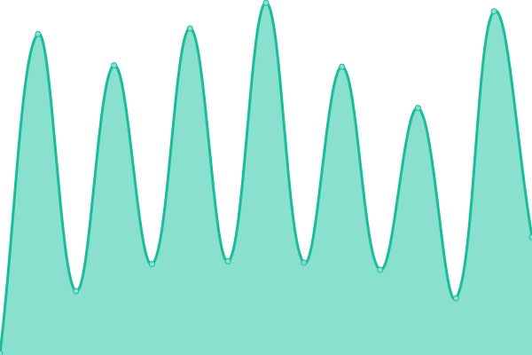
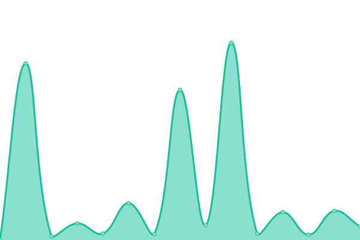

# [📈 Live Status](https://ravyshankar.github.io/cwp-status-uptime/): <!--live status--> **🟧 Partial outage**

This repository contains the open-source uptime monitor and status page for [GovTech GDP](https://GovTech GDP.github.io/CWP-Websites-UpTime-Status), powered by [Upptime](https://github.com/upptime/upptime).

<!--start: status pages-->
<!-- This summary is generated by Upptime (https://github.com/upptime/upptime) -->
<!-- Do not edit this manually, your changes will be overwritten -->
<!-- prettier-ignore -->
| URL | Status | History | Response Time | Uptime |
| --- | ------ | ------- | ------------- | ------ |
|  [MHA](https://www.mha.gov.sg) | 🟩 Up | [mha.yml](https://github.com/ravyshankar/cwp-status-uptime/commits/HEAD/history/mha.yml) | 

 223ms
     
 | 

<a href="https://ravyshankar.github.io/cwp-status-uptime/history/mha">100.00%</a>
    

|  [ICA](https://www.ica.gov.sg) | 🟩 Up | [ica.yml](https://github.com/ravyshankar/cwp-status-uptime/commits/HEAD/history/ica.yml) | 

 231ms
     
 | 

<a href="https://ravyshankar.github.io/cwp-status-uptime/history/ica">100.00%</a>
    

|  [MFA](https://www.mfa.gov.sg) | 🟩 Up | [mfa.yml](https://github.com/ravyshankar/cwp-status-uptime/commits/HEAD/history/mfa.yml) | 

 154ms
     
 | 

<a href="https://ravyshankar.github.io/cwp-status-uptime/history/mfa">100.00%</a>
    

|  [NEA](https://www.nea.gov.sg) | 🟩 Up | [nea.yml](https://github.com/ravyshankar/cwp-status-uptime/commits/HEAD/history/nea.yml) | 

 483ms
     
 | 

<a href="https://ravyshankar.github.io/cwp-status-uptime/history/nea">100.00%</a>
    

|  [MOH](https://www.moh.gov.sg) | 🟩 Up | [moh.yml](https://github.com/ravyshankar/cwp-status-uptime/commits/HEAD/history/moh.yml) | 

 312ms
     
 | 

<a href="https://ravyshankar.github.io/cwp-status-uptime/history/moh">100.00%</a>
    

|  [SLA](https://www.sla.gov.sg) | 🟩 Up | [sla.yml](https://github.com/ravyshankar/cwp-status-uptime/commits/HEAD/history/sla.yml) | 

 181ms
     
 | 

<a href="https://ravyshankar.github.io/cwp-status-uptime/history/sla">100.00%</a>
    

|  [NPARKS](https://www.nparks.gov.sg) | 🟥 Down | [nparks.yml](https://github.com/ravyshankar/cwp-status-uptime/commits/HEAD/history/nparks.yml) | 

 0ms
     
 | 

<a href="https://ravyshankar.github.io/cwp-status-uptime/history/nparks">0.00%</a>
    

<!--end: status pages-->
