# [📈 Live Status](https://ravyshankar.github.io/cwp-status-uptime/): <!--live status--> **🟧 Partial outage**

- This repository tracks [CWP Websites](https://ravyshankar.github.io/cwp-status-uptime)
  - uptime
  - response time
  - status and
  - shows historical data. 
- Automatically creates [Issues in Github aka Incident Tickets ](https://github.com/ravyshankar/cwp-status-uptime/issues) and assigns it to a team or a Individual. 
- The [Actions](https://github.com/ravyshankar/cwp-status-uptime/actions) on the issue can be tracked and used for reporting, and 
- [Pages](https://ravyshankar.github.io/cwp-status-uptime) for the status page with the current and past incidents.

<!--start: status pages-->
<!-- This summary is generated by Upptime (https://github.com/upptime/upptime) -->
<!-- Do not edit this manually, your changes will be overwritten -->
<!-- prettier-ignore -->
| URL | Status | History | Response Time | Uptime |
| --- | ------ | ------- | ------------- | ------ |
|  [MHA](www.mha.gov.sg) | 🟩 Up | [mha.yml](https://github.com/ravyshankar/cwp-status-uptime/commits/HEAD/history/mha.yml) | 

 148ms
     
 | 

<a href="https://ravyshankar.github.io/cwp-status-uptime/history/mha">100.00%</a>
    

|  [ICA](www.ica.gov.sg) | 🟩 Up | [ica.yml](https://github.com/ravyshankar/cwp-status-uptime/commits/HEAD/history/ica.yml) | 

 149ms
     
 | 

<a href="https://ravyshankar.github.io/cwp-status-uptime/history/ica">100.00%</a>
    

|  [MFA](www.mfa.gov.sg) | 🟩 Up | [mfa.yml](https://github.com/ravyshankar/cwp-status-uptime/commits/HEAD/history/mfa.yml) | 

 164ms
     
 | 

<a href="https://ravyshankar.github.io/cwp-status-uptime/history/mfa">100.00%</a>
    

|  [NEA](www.nea.gov.sg) | 🟩 Up | [nea.yml](https://github.com/ravyshankar/cwp-status-uptime/commits/HEAD/history/nea.yml) | 

 572ms
     
 | 

<a href="https://ravyshankar.github.io/cwp-status-uptime/history/nea">100.00%</a>
    

|  [MOH](www.moh.gov.sg) | 🟩 Up | [moh.yml](https://github.com/ravyshankar/cwp-status-uptime/commits/HEAD/history/moh.yml) | 

 1368ms
     
 | 

<a href="https://ravyshankar.github.io/cwp-status-uptime/history/moh">100.00%</a>
    

|  [SLA](www.sla.gov.sg) | 🟩 Up | [sla.yml](https://github.com/ravyshankar/cwp-status-uptime/commits/HEAD/history/sla.yml) | 

 575ms
     
 | 

<a href="https://ravyshankar.github.io/cwp-status-uptime/history/sla">98.71%</a>
    

|  [NPARKS](www.nparks.gov.sg) | 🟩 Up | [nparks.yml](https://github.com/ravyshankar/cwp-status-uptime/commits/HEAD/history/nparks.yml) | 

 176ms
     
 | 

<a href="https://ravyshankar.github.io/cwp-status-uptime/history/nparks">100.00%</a>
    

|  [ACRA](www.acra.gov.sg) | 🟩 Up | [acra.yml](https://github.com/ravyshankar/cwp-status-uptime/commits/HEAD/history/acra.yml) | 

 245ms
     
 | 

<a href="https://ravyshankar.github.io/cwp-status-uptime/history/acra">100.00%</a>
    

|  [AGC](www.agc.gov.sg) | 🟩 Up | [agc.yml](https://github.com/ravyshankar/cwp-status-uptime/commits/HEAD/history/agc.yml) | 

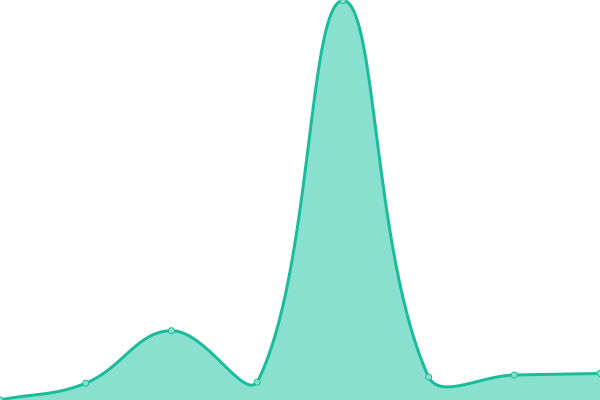 395ms
     
 | 

<a href="https://ravyshankar.github.io/cwp-status-uptime/history/agc">100.00%</a>
    

|  [LSC](www.lsc.gov.sg) | 🟩 Up | [lsc.yml](https://github.com/ravyshankar/cwp-status-uptime/commits/HEAD/history/lsc.yml) | 

 1195ms
     
 | 

<a href="https://ravyshankar.github.io/cwp-status-uptime/history/lsc">100.00%</a>
    

|  [A-Star](www.a-star.edu.sg) | 🟩 Up | [a-star.yml](https://github.com/ravyshankar/cwp-status-uptime/commits/HEAD/history/a-star.yml) | 

 582ms
     
 | 

<a href="https://ravyshankar.github.io/cwp-status-uptime/history/a-star">98.81%</a>
    

|  [BCA Academy](www.bcaa.edu.sg) | 🟩 Up | [bca-academy.yml](https://github.com/ravyshankar/cwp-status-uptime/commits/HEAD/history/bca-academy.yml) | 

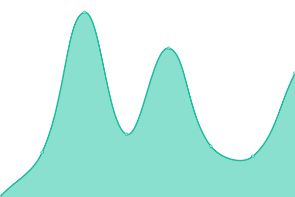 251ms
     
 | 

<a href="https://ravyshankar.github.io/cwp-status-uptime/history/bca-academy">100.00%</a>
    

|  [BCA](www1.bca.gov.sg) | 🟩 Up | [bca.yml](https://github.com/ravyshankar/cwp-status-uptime/commits/HEAD/history/bca.yml) | 

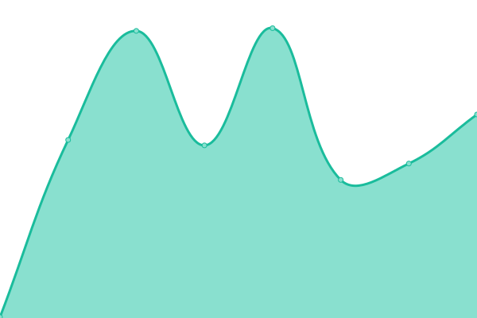 1066ms
     
 | 

<a href="https://ravyshankar.github.io/cwp-status-uptime/history/bca">100.00%</a>
    

|  [CAAS](www.caas.gov.sg) | 🟩 Up | [caas.yml](https://github.com/ravyshankar/cwp-status-uptime/commits/HEAD/history/caas.yml) | 

 163ms
     
 | 

<a href="https://ravyshankar.github.io/cwp-status-uptime/history/caas">100.00%</a>
    

|  [SINGSTAT](www.singstat.gov.sg) | 🟩 Up | [singstat.yml](https://github.com/ravyshankar/cwp-status-uptime/commits/HEAD/history/singstat.yml) | 

 178ms
     
 | 

<a href="https://ravyshankar.github.io/cwp-status-uptime/history/singstat">100.00%</a>
    

|  [DSTA](www.dsta.gov.sg) | 🟩 Up | [dsta.yml](https://github.com/ravyshankar/cwp-status-uptime/commits/HEAD/history/dsta.yml) | 

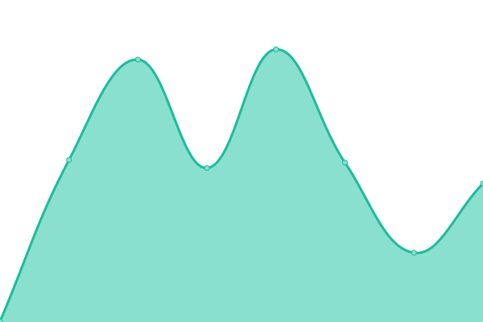 335ms
     
 | 

<a href="https://ravyshankar.github.io/cwp-status-uptime/history/dsta">100.00%</a>
    

|  [Tech Summit](www.techsummit.sg) | 🟩 Up | [tech-summit.yml](https://github.com/ravyshankar/cwp-status-uptime/commits/HEAD/history/tech-summit.yml) | 

 1457ms
     
 | 

<a href="https://ravyshankar.github.io/cwp-status-uptime/history/tech-summit">100.00%</a>
    

|  [CCCS](www.cccs.gov.sg) | 🟩 Up | [cccs.yml](https://github.com/ravyshankar/cwp-status-uptime/commits/HEAD/history/cccs.yml) | 

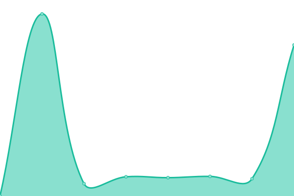 222ms
     
 | 

<a href="https://ravyshankar.github.io/cwp-status-uptime/history/cccs">100.00%</a>
    

|  [Open Innovation Network](www.openinnovationnetwork.gov.sg) | 🟩 Up | [open-innovation-network.yml](https://github.com/ravyshankar/cwp-status-uptime/commits/HEAD/history/open-innovation-network.yml) | 

 226ms
     
 | 

<a href="https://ravyshankar.github.io/cwp-status-uptime/history/open-innovation-network">100.00%</a>
    

|  [The Digital Academy](www.thedigitalacademy.tech.gov.sg) | 🟩 Up | [the-digital-academy.yml](https://github.com/ravyshankar/cwp-status-uptime/commits/HEAD/history/the-digital-academy.yml) | 

 202ms
     
 | 

<a href="https://ravyshankar.github.io/cwp-status-uptime/history/the-digital-academy">100.00%</a>
    

|  [GRA](www.gra.gov.sg) | 🟩 Up | [gra.yml](https://github.com/ravyshankar/cwp-status-uptime/commits/HEAD/history/gra.yml) | 

 395ms
     
 | 

<a href="https://ravyshankar.github.io/cwp-status-uptime/history/gra">100.00%</a>
    

|  [MYNICEHOME](www.mynicehome.gov.sg) | 🟩 Up | [mynicehome.yml](https://github.com/ravyshankar/cwp-status-uptime/commits/HEAD/history/mynicehome.yml) | 

 643ms
     
 | 

<a href="https://ravyshankar.github.io/cwp-status-uptime/history/mynicehome">100.00%</a>
    

|  [HSA](www.hsa.gov.sg) | 🟩 Up | [hsa.yml](https://github.com/ravyshankar/cwp-status-uptime/commits/HEAD/history/hsa.yml) | 

 160ms
     
 | 

<a href="https://ravyshankar.github.io/cwp-status-uptime/history/hsa">100.00%</a>
    

|  [HTX](www.htx.gov.sg) | 🟩 Up | [htx.yml](https://github.com/ravyshankar/cwp-status-uptime/commits/HEAD/history/htx.yml) | 

 598ms
     
 | 

<a href="https://ravyshankar.github.io/cwp-status-uptime/history/htx">100.00%</a>
    

|  [IMDA](www.imda.gov.sg) | 🟩 Up | [imda.yml](https://github.com/ravyshankar/cwp-status-uptime/commits/HEAD/history/imda.yml) | 

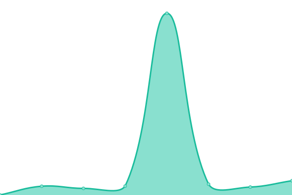 222ms
     
 | 

<a href="https://ravyshankar.github.io/cwp-status-uptime/history/imda">100.00%</a>
    

|  [PDPC](www.pdpc.gov.sg) | 🟩 Up | [pdpc.yml](https://github.com/ravyshankar/cwp-status-uptime/commits/HEAD/history/pdpc.yml) | 

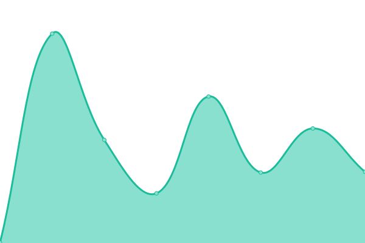 209ms
     
 | 

<a href="https://ravyshankar.github.io/cwp-status-uptime/history/pdpc">100.00%</a>
    

|  [MCCY](www.mccy.gov.sg) | 🟩 Up | [mccy.yml](https://github.com/ravyshankar/cwp-status-uptime/commits/HEAD/history/mccy.yml) | 

 168ms
     
 | 

<a href="https://ravyshankar.github.io/cwp-status-uptime/history/mccy">100.00%</a>
    

|  [IPOS](www.ipos.gov.sg) | 🟩 Up | [ipos.yml](https://github.com/ravyshankar/cwp-status-uptime/commits/HEAD/history/ipos.yml) | 

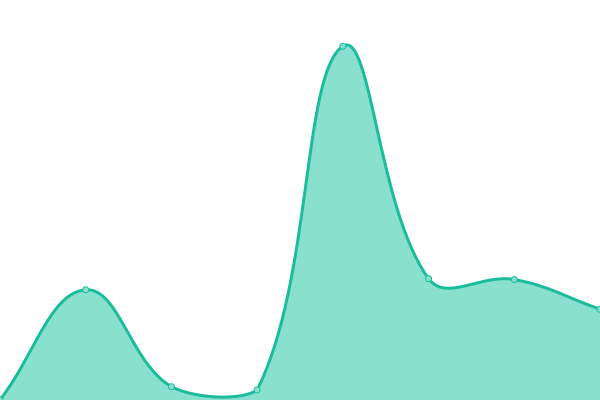 168ms
     
 | 

<a href="https://ravyshankar.github.io/cwp-status-uptime/history/ipos">100.00%</a>
    

|  [ISEAS](www.iseas.edu.sg) | 🟩 Up | [iseas.yml](https://github.com/ravyshankar/cwp-status-uptime/commits/HEAD/history/iseas.yml) | 

 229ms
     
 | 

<a href="https://ravyshankar.github.io/cwp-status-uptime/history/iseas">100.00%</a>
    

|  [Police](www.police.gov.sg) | 🟩 Up | [police.yml](https://github.com/ravyshankar/cwp-status-uptime/commits/HEAD/history/police.yml) | 

 182ms
     
 | 

<a href="https://ravyshankar.github.io/cwp-status-uptime/history/police">98.72%</a>
    

|  [ITE](www.ite.edu.sg) | 🟥 Down | [ite.yml](https://github.com/ravyshankar/cwp-status-uptime/commits/HEAD/history/ite.yml) | 

 169ms
     
 | 

<a href="https://ravyshankar.github.io/cwp-status-uptime/history/ite">66.58%</a>
    

|  [PowerEveryMove](www.powereverymove.gov.sg) | 🟩 Up | [power-every-move.yml](https://github.com/ravyshankar/cwp-status-uptime/commits/HEAD/history/power-every-move.yml) | 

 184ms
     
 | 

<a href="https://ravyshankar.github.io/cwp-status-uptime/history/power-every-move">100.00%</a>
    

|  [MTI](www.mti.gov.sg) | 🟩 Up | [mti.yml](https://github.com/ravyshankar/cwp-status-uptime/commits/HEAD/history/mti.yml) | 

 562ms
     
 | 

<a href="https://ravyshankar.github.io/cwp-status-uptime/history/mti">98.72%</a>
    

|  [MSF](www.msf.gov.sg) | 🟩 Up | [msf.yml](https://github.com/ravyshankar/cwp-status-uptime/commits/HEAD/history/msf.yml) | 

 197ms
     
 | 

<a href="https://ravyshankar.github.io/cwp-status-uptime/history/msf">100.00%</a>
    

|  [ECDA](www.ecda.gov.sg) | 🟩 Up | [ecda.yml](https://github.com/ravyshankar/cwp-status-uptime/commits/HEAD/history/ecda.yml) | 

 484ms
     
 | 

<a href="https://ravyshankar.github.io/cwp-status-uptime/history/ecda">100.00%</a>
    

|  [SNTC](www.sntc.org.sg) | 🟩 Up | [sntc.yml](https://github.com/ravyshankar/cwp-status-uptime/commits/HEAD/history/sntc.yml) | 

 150ms
     
 | 

<a href="https://ravyshankar.github.io/cwp-status-uptime/history/sntc">100.00%</a>
    

|  [MUIS](www.muis.gov.sg) | 🟩 Up | [muis.yml](https://github.com/ravyshankar/cwp-status-uptime/commits/HEAD/history/muis.yml) | 

 1425ms
     
 | 

<a href="https://ravyshankar.github.io/cwp-status-uptime/history/muis">100.00%</a>
    

|  [CNB](www.cnb.gov.sg) | 🟩 Up | [cnb.yml](https://github.com/ravyshankar/cwp-status-uptime/commits/HEAD/history/cnb.yml) | 

 549ms
     
 | 

<a href="https://ravyshankar.github.io/cwp-status-uptime/history/cnb">100.00%</a>
    

|  [ICA](www.ica.gov.sg) | 🟩 Up | [ica.yml](https://github.com/ravyshankar/cwp-status-uptime/commits/HEAD/history/ica.yml) | 

 149ms
     
 | 

<a href="https://ravyshankar.github.io/cwp-status-uptime/history/ica">100.00%</a>
    

|  [MHA](www.mha.gov.sg) | 🟩 Up | [mha.yml](https://github.com/ravyshankar/cwp-status-uptime/commits/HEAD/history/mha.yml) | 

 148ms
     
 | 

<a href="https://ravyshankar.github.io/cwp-status-uptime/history/mha">100.00%</a>
    

|  [SGSECURE](www.sgsecure.gov.sg) | 🟩 Up | [sgsecure.yml](https://github.com/ravyshankar/cwp-status-uptime/commits/HEAD/history/sgsecure.yml) | 

 147ms
     
 | 

<a href="https://ravyshankar.github.io/cwp-status-uptime/history/sgsecure">100.00%</a>
    

|  [SCDF](www.scdf.gov.sg) | 🟩 Up | [scdf.yml](https://github.com/ravyshankar/cwp-status-uptime/commits/HEAD/history/scdf.yml) | 

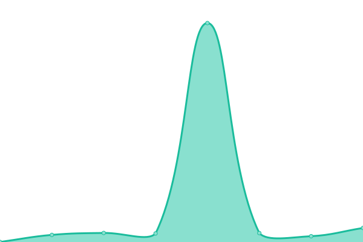 189ms
     
 | 

<a href="https://ravyshankar.github.io/cwp-status-uptime/history/scdf">100.00%</a>
    

|  [CMPB](www.cmpb.gov.sg) | 🟩 Up | [cmpb.yml](https://github.com/ravyshankar/cwp-status-uptime/commits/HEAD/history/cmpb.yml) | 

 477ms
     
 | 

<a href="https://ravyshankar.github.io/cwp-status-uptime/history/cmpb">100.00%</a>
    

|  [MINDEF](www.mindef.gov.sg) | 🟩 Up | [mindef.yml](https://github.com/ravyshankar/cwp-status-uptime/commits/HEAD/history/mindef.yml) | 

 249ms
     
 | 

<a href="https://ravyshankar.github.io/cwp-status-uptime/history/mindef">100.00%</a>
    

|  [DEFENCEPIONEER](www.defencepioneer.sg) | 🟩 Up | [defencepioneer.yml](https://github.com/ravyshankar/cwp-status-uptime/commits/HEAD/history/defencepioneer.yml) | 

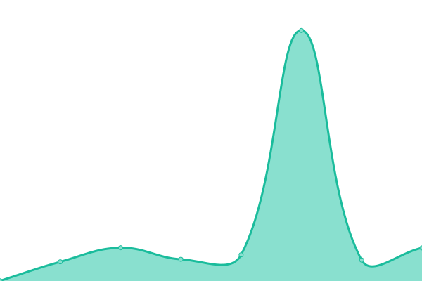 161ms
     
 | 

<a href="https://ravyshankar.github.io/cwp-status-uptime/history/defencepioneer">100.00%</a>
    

|  [PIONEERMAGAZINE](www.defencepioneer.sg) | 🟩 Up | [pioneermagazine.yml](https://github.com/ravyshankar/cwp-status-uptime/commits/HEAD/history/pioneermagazine.yml) | 

 25ms
     
 | 

<a href="https://ravyshankar.github.io/cwp-status-uptime/history/pioneermagazine">100.00%</a>
    

|  [CLC](www.clc.gov.sg) | 🟩 Up | [clc.yml](https://github.com/ravyshankar/cwp-status-uptime/commits/HEAD/history/clc.yml) | 

 1217ms
     
 | 

<a href="https://ravyshankar.github.io/cwp-status-uptime/history/clc">100.00%</a>
    

|  [MND](www.mnd.gov.sg) | 🟩 Up | [mnd.yml](https://github.com/ravyshankar/cwp-status-uptime/commits/HEAD/history/mnd.yml) | 

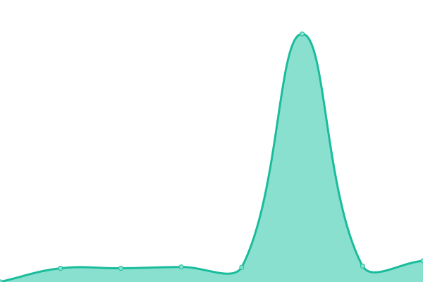 142ms
     
 | 

<a href="https://ravyshankar.github.io/cwp-status-uptime/history/mnd">100.00%</a>
    

|  [ONESERVICE](www.oneservice.gov.sg) | 🟩 Up | [oneservice.yml](https://github.com/ravyshankar/cwp-status-uptime/commits/HEAD/history/oneservice.yml) | 

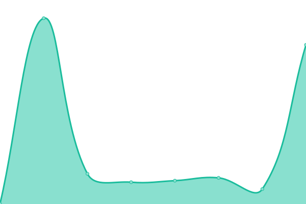 188ms
     
 | 

<a href="https://ravyshankar.github.io/cwp-status-uptime/history/oneservice">100.00%</a>
    

|  [WORLDCITIZENSSUMMIT](www.worldcitiessummit.com.sg) | 🟩 Up | [worldcitizenssummit.yml](https://github.com/ravyshankar/cwp-status-uptime/commits/HEAD/history/worldcitizenssummit.yml) | 

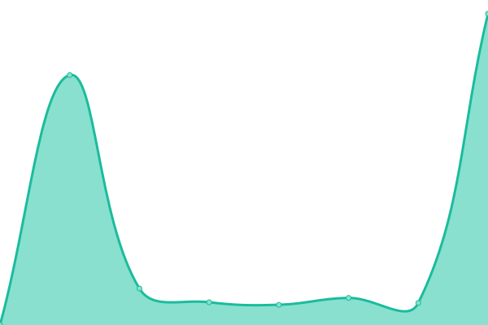 269ms
     
 | 

<a href="https://ravyshankar.github.io/cwp-status-uptime/history/worldcitizenssummit">98.72%</a>
    

|  [FOUNDERSMEMORIAL](www.foundersmemorial.gov.sg) | 🟩 Up | [foundersmemorial.yml](https://github.com/ravyshankar/cwp-status-uptime/commits/HEAD/history/foundersmemorial.yml) | 

 414ms
     
 | 

<a href="https://ravyshankar.github.io/cwp-status-uptime/history/foundersmemorial">98.72%</a>
    

|  [CSIT](www.csit.gov.sg) | 🟩 Up | [csit.yml](https://github.com/ravyshankar/cwp-status-uptime/commits/HEAD/history/csit.yml) | 

 173ms
     
 | 

<a href="https://ravyshankar.github.io/cwp-status-uptime/history/csit">100.00%</a>
    

|  [MOE Language Center](www.moelc.moe.edu.sg) | 🟩 Up | [moe-language-center.yml](https://github.com/ravyshankar/cwp-status-uptime/commits/HEAD/history/moe-language-center.yml) | 

 140ms
     
 | 

<a href="https://ravyshankar.github.io/cwp-status-uptime/history/moe-language-center">100.00%</a>
    

|  [Schoolbag](www.schoolbag.edu.sg) | 🟩 Up | [schoolbag.yml](https://github.com/ravyshankar/cwp-status-uptime/commits/HEAD/history/schoolbag.yml) | 

 468ms
     
 | 

<a href="https://ravyshankar.github.io/cwp-status-uptime/history/schoolbag">100.00%</a>
    

|  [National English Movement](www.nel.moe.edu.sg) | 🟩 Up | [national-english-movement.yml](https://github.com/ravyshankar/cwp-status-uptime/commits/HEAD/history/national-english-movement.yml) | 

 261ms
     
 | 

<a href="https://ravyshankar.github.io/cwp-status-uptime/history/national-english-movement">98.72%</a>
    

|  [ACE HTA](www.ace-hta.gov.sg) | 🟩 Up | [ace-hta.yml](https://github.com/ravyshankar/cwp-status-uptime/commits/HEAD/history/ace-hta.yml) | 

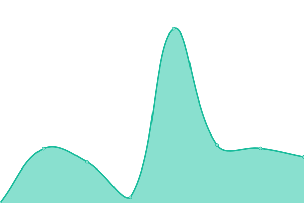 858ms
     
 | 

<a href="https://ravyshankar.github.io/cwp-status-uptime/history/ace-hta">100.00%</a>
    

|  [Health Professionals](www.healthprofessionals.gov.sg) | 🟩 Up | [health-professionals.yml](https://github.com/ravyshankar/cwp-status-uptime/commits/HEAD/history/health-professionals.yml) | 

 150ms
     
 | 

<a href="https://ravyshankar.github.io/cwp-status-uptime/history/health-professionals">100.00%</a>
    

|  [NDF](www.ndf.gov.sg) | 🟩 Up | [ndf.yml](https://github.com/ravyshankar/cwp-status-uptime/commits/HEAD/history/ndf.yml) | 

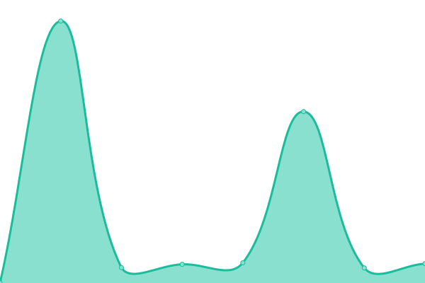 467ms
     
 | 

<a href="https://ravyshankar.github.io/cwp-status-uptime/history/ndf">100.00%</a>
    

|  [MOF](www.mof.gov.sg) | 🟩 Up | [mof.yml](https://github.com/ravyshankar/cwp-status-uptime/commits/HEAD/history/mof.yml) | 

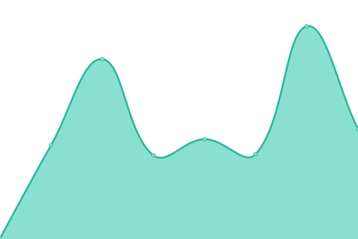 121ms
     
 | 

<a href="https://ravyshankar.github.io/cwp-status-uptime/history/mof">100.00%</a>
    

|  [NMRC](www.nmrc.gov.sg) | 🟩 Up | [nmrc.yml](https://github.com/ravyshankar/cwp-status-uptime/commits/HEAD/history/nmrc.yml) | 

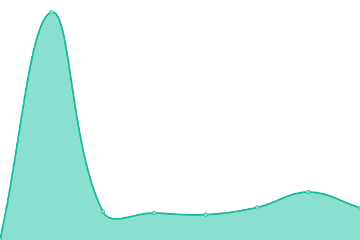 215ms
     
 | 

<a href="https://ravyshankar.github.io/cwp-status-uptime/history/nmrc">100.00%</a>
    

|  [NNA](www.nna.gov.sg) | 🟩 Up | [nna.yml](https://github.com/ravyshankar/cwp-status-uptime/commits/HEAD/history/nna.yml) | 

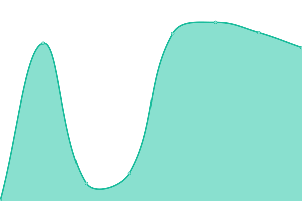 175ms
     
 | 

<a href="https://ravyshankar.github.io/cwp-status-uptime/history/nna">100.00%</a>
    

|  [Roots](www.roots.gov.sg) | 🟩 Up | [roots.yml](https://github.com/ravyshankar/cwp-status-uptime/commits/HEAD/history/roots.yml) | 

 216ms
     
 | 

<a href="https://ravyshankar.github.io/cwp-status-uptime/history/roots">98.72%</a>
    

|  [MOT](www.mot.gov.sg) | 🟩 Up | [mot.yml](https://github.com/ravyshankar/cwp-status-uptime/commits/HEAD/history/mot.yml) | 

 208ms
     
 | 

<a href="https://ravyshankar.github.io/cwp-status-uptime/history/mot">100.00%</a>
    

|  [MPA](www.mpa.gov.sg) | 🟩 Up | [mpa.yml](https://github.com/ravyshankar/cwp-status-uptime/commits/HEAD/history/mpa.yml) | 

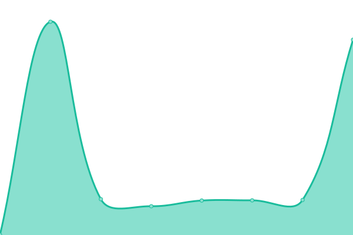 226ms
     
 | 

<a href="https://ravyshankar.github.io/cwp-status-uptime/history/mpa">100.00%</a>
    

|  [SMW](www.smw.sg) | 🟩 Up | [smw.yml](https://github.com/ravyshankar/cwp-status-uptime/commits/HEAD/history/smw.yml) | 

 1259ms
     
 | 

<a href="https://ravyshankar.github.io/cwp-status-uptime/history/smw">100.00%</a>
    

|  [Gogreen](www.gogreen.gov.sg) | 🟩 Up | [gogreen.yml](https://github.com/ravyshankar/cwp-status-uptime/commits/HEAD/history/gogreen.yml) | 

 146ms
     
 | 

<a href="https://ravyshankar.github.io/cwp-status-uptime/history/gogreen">100.00%</a>
    

|  [Indian Heritage](www.indianheritage.gov.sg) | 🟩 Up | [indian-heritage.yml](https://github.com/ravyshankar/cwp-status-uptime/commits/HEAD/history/indian-heritage.yml) | 

 432ms
     
 | 

<a href="https://ravyshankar.github.io/cwp-status-uptime/history/indian-heritage">98.72%</a>
    

|  [Language Councils](www.languagecouncils.sg) | 🟩 Up | [language-councils.yml](https://github.com/ravyshankar/cwp-status-uptime/commits/HEAD/history/language-councils.yml) | 

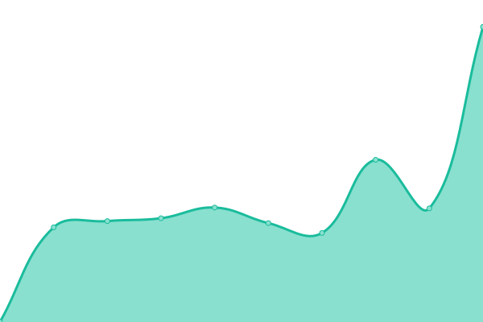 1194ms
     
 | 

<a href="https://ravyshankar.github.io/cwp-status-uptime/history/language-councils">98.72%</a>
    

|  [Comchest](www.comchest.gov.sg) | 🟩 Up | [comchest.yml](https://github.com/ravyshankar/cwp-status-uptime/commits/HEAD/history/comchest.yml) | 

 166ms
     
 | 

<a href="https://ravyshankar.github.io/cwp-status-uptime/history/comchest">100.00%</a>
    

|  [CGS](www.cgs.gov.sg) | 🟩 Up | [cgs.yml](https://github.com/ravyshankar/cwp-status-uptime/commits/HEAD/history/cgs.yml) | 

 149ms
     
 | 

<a href="https://ravyshankar.github.io/cwp-status-uptime/history/cgs">100.00%</a>
    

|  [Cleanenvirosummit](www.cleanenvirosummit.gov.sg) | 🟩 Up | [cleanenvirosummit.yml](https://github.com/ravyshankar/cwp-status-uptime/commits/HEAD/history/cleanenvirosummit.yml) | 

 583ms
     
 | 

<a href="https://ravyshankar.github.io/cwp-status-uptime/history/cleanenvirosummit">100.00%</a>
    

|  [Haze](www.haze.gov.sg) | 🟩 Up | [haze.yml](https://github.com/ravyshankar/cwp-status-uptime/commits/HEAD/history/haze.yml) | 

 170ms
     
 | 

<a href="https://ravyshankar.github.io/cwp-status-uptime/history/haze">100.00%</a>
    

|  [MSS-INT](www.mss-int.sg) | 🟩 Up | [mss-int.yml](https://github.com/ravyshankar/cwp-status-uptime/commits/HEAD/history/mss-int.yml) | 

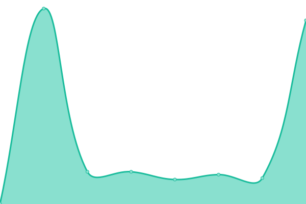 201ms
     
 | 

<a href="https://ravyshankar.github.io/cwp-status-uptime/history/mss-int">100.00%</a>
    

|  [NEA](www.nea.gov.sg) | 🟩 Up | [nea.yml](https://github.com/ravyshankar/cwp-status-uptime/commits/HEAD/history/nea.yml) | 

 572ms
     
 | 

<a href="https://ravyshankar.github.io/cwp-status-uptime/history/nea">100.00%</a>
    

|  [Public Hygiene Board](www.publichygienecouncil.sg) | 🟩 Up | [public-hygiene-board.yml](https://github.com/ravyshankar/cwp-status-uptime/commits/HEAD/history/public-hygiene-board.yml) | 

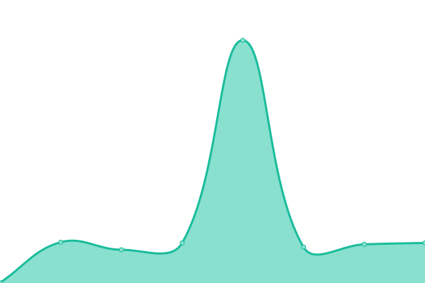 188ms
     
 | 

<a href="https://ravyshankar.github.io/cwp-status-uptime/history/public-hygiene-board">100.00%</a>
    

|  [NHB](www.nhb.gov.sg) | 🟩 Up | [nhb.yml](https://github.com/ravyshankar/cwp-status-uptime/commits/HEAD/history/nhb.yml) | 

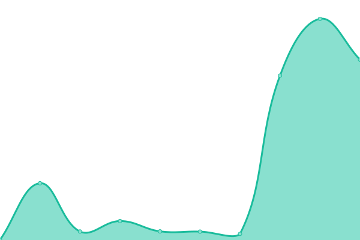 255ms
     
 | 

<a href="https://ravyshankar.github.io/cwp-status-uptime/history/nhb">98.72%</a>
    

|  [SG Heritage Festival](www.sgheritagefest.gov.sg) | 🟩 Up | [sg-heritage-festival.yml](https://github.com/ravyshankar/cwp-status-uptime/commits/HEAD/history/sg-heritage-festival.yml) | 

 376ms
     
 | 

<a href="https://ravyshankar.github.io/cwp-status-uptime/history/sg-heritage-festival">98.72%</a>
    

|  [Night Festival](www.nightfestival.gov.sg) | 🟩 Up | [night-festival.yml](https://github.com/ravyshankar/cwp-status-uptime/commits/HEAD/history/night-festival.yml) | 

 171ms
     
 | 

<a href="https://ravyshankar.github.io/cwp-status-uptime/history/night-festival">98.72%</a>
    

|  [SYSNMH](www.sysnmh.org.sg) | 🟩 Up | [sysnmh.yml](https://github.com/ravyshankar/cwp-status-uptime/commits/HEAD/history/sysnmh.yml) | 

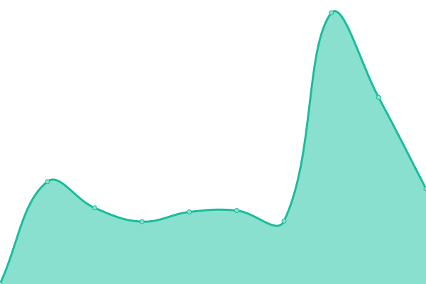 738ms
     
 | 

<a href="https://ravyshankar.github.io/cwp-status-uptime/history/sysnmh">98.72%</a>
    

|  [MOE](www.moe.gov.sg) | 🟩 Up | [moe.yml](https://github.com/ravyshankar/cwp-status-uptime/commits/HEAD/history/moe.yml) | 

 132ms
     
 | 

<a href="https://ravyshankar.github.io/cwp-status-uptime/history/moe">98.72%</a>
    

|  [NP](www.np.edu.sg) | 🟩 Up | [np.yml](https://github.com/ravyshankar/cwp-status-uptime/commits/HEAD/history/np.yml) | 

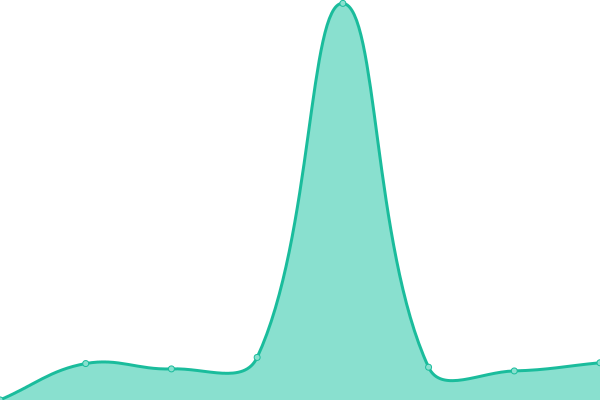 705ms
     
 | 

<a href="https://ravyshankar.github.io/cwp-status-uptime/history/np">100.00%</a>
    

|  [RP](www.rp.edu.sg) | 🟩 Up | [rp.yml](https://github.com/ravyshankar/cwp-status-uptime/commits/HEAD/history/rp.yml) | 

 193ms
     
 | 

<a href="https://ravyshankar.github.io/cwp-status-uptime/history/rp">100.00%</a>
    

|  [SP](www.sp.edu.sg) | 🟩 Up | [sp.yml](https://github.com/ravyshankar/cwp-status-uptime/commits/HEAD/history/sp.yml) | 

 182ms
     
 | 

<a href="https://ravyshankar.github.io/cwp-status-uptime/history/sp">100.00%</a>
    

|  [SG Heritage Festival](www.sgheritagefest.gov.sg) | 🟩 Up | [sg-heritage-festival.yml](https://github.com/ravyshankar/cwp-status-uptime/commits/HEAD/history/sg-heritage-festival.yml) | 

 376ms
     
 | 

<a href="https://ravyshankar.github.io/cwp-status-uptime/history/sg-heritage-festival">98.72%</a>
    

|  [Night Festival](www.nightfestival.gov.sg) | 🟩 Up | [night-festival.yml](https://github.com/ravyshankar/cwp-status-uptime/commits/HEAD/history/night-festival.yml) | 

 171ms
     
 | 

<a href="https://ravyshankar.github.io/cwp-status-uptime/history/night-festival">98.72%</a>
    

|  [CE NP](www.cet.np.edu.sg) | 🟩 Up | [ce-np.yml](https://github.com/ravyshankar/cwp-status-uptime/commits/HEAD/history/ce-np.yml) | 

 1183ms
     
 | 

<a href="https://ravyshankar.github.io/cwp-status-uptime/history/ce-np">100.00%</a>
    

|  [Digital for Live](www.digitalforlife.gov.sg) | 🟩 Up | [digital-for-live.yml](https://github.com/ravyshankar/cwp-status-uptime/commits/HEAD/history/digital-for-live.yml) | 

 173ms
     
 | 

<a href="https://ravyshankar.github.io/cwp-status-uptime/history/digital-for-live">100.00%</a>
    

|  [Infrastructure Asia](www.infrastructureasia.org) | 🟩 Up | [infrastructure-asia.yml](https://github.com/ravyshankar/cwp-status-uptime/commits/HEAD/history/infrastructure-asia.yml) | 

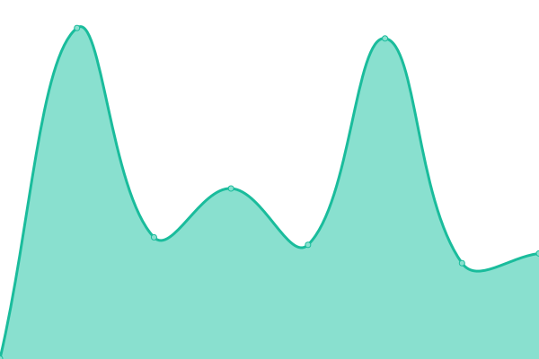 298ms
     
 | 

<a href="https://ravyshankar.github.io/cwp-status-uptime/history/infrastructure-asia">100.00%</a>
    

|  [Istana](www.istana.gov.sg) | 🟩 Up | [istana.yml](https://github.com/ravyshankar/cwp-status-uptime/commits/HEAD/history/istana.yml) | 

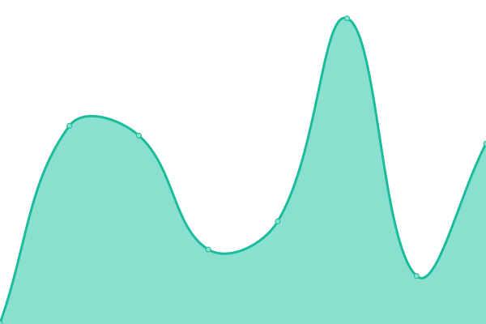 795ms
     
 | 

<a href="https://ravyshankar.github.io/cwp-status-uptime/history/istana">98.72%</a>
    

|  [MFA](www.mfa.gov.sg) | 🟩 Up | [mfa.yml](https://github.com/ravyshankar/cwp-status-uptime/commits/HEAD/history/mfa.yml) | 

 164ms
     
 | 

<a href="https://ravyshankar.github.io/cwp-status-uptime/history/mfa">100.00%</a>
    

|  [MOE](www.moe.gov.sg/microsites) | 🟩 Up | [moe.yml](https://github.com/ravyshankar/cwp-status-uptime/commits/HEAD/history/moe.yml) | 

 132ms
     
 | 

<a href="https://ravyshankar.github.io/cwp-status-uptime/history/moe">98.72%</a>
    

|  [PMO](www.pmo.gov.sg) | 🟩 Up | [pmo.yml](https://github.com/ravyshankar/cwp-status-uptime/commits/HEAD/history/pmo.yml) | 

 128ms
     
 | 

<a href="https://ravyshankar.github.io/cwp-status-uptime/history/pmo">98.71%</a>
    

|  [Parliament](www.parliament.gov.sg) | 🟩 Up | [parliament.yml](https://github.com/ravyshankar/cwp-status-uptime/commits/HEAD/history/parliament.yml) | 

 144ms
     
 | 

<a href="https://ravyshankar.github.io/cwp-status-uptime/history/parliament">100.00%</a>
    

|  [TAL](www.tal.sg) | 🟩 Up | [tal.yml](https://github.com/ravyshankar/cwp-status-uptime/commits/HEAD/history/tal.yml) | 

 730ms
     
 | 

<a href="https://ravyshankar.github.io/cwp-status-uptime/history/tal">98.72%</a>
    

|  [Public Transport Council](www.ptc.gov.sg) | 🟩 Up | [public-transport-council.yml](https://github.com/ravyshankar/cwp-status-uptime/commits/HEAD/history/public-transport-council.yml) | 

 374ms
     
 | 

<a href="https://ravyshankar.github.io/cwp-status-uptime/history/public-transport-council">100.00%</a>
    

|  [PSC](www.psc.gov.sg) | 🟩 Up | [psc.yml](https://github.com/ravyshankar/cwp-status-uptime/commits/HEAD/history/psc.yml) | 

 460ms
     
 | 

<a href="https://ravyshankar.github.io/cwp-status-uptime/history/psc">100.00%</a>
    

|  [PUB](www.pub.gov.sg) | 🟩 Up | [pub.yml](https://github.com/ravyshankar/cwp-status-uptime/commits/HEAD/history/pub.yml) | 

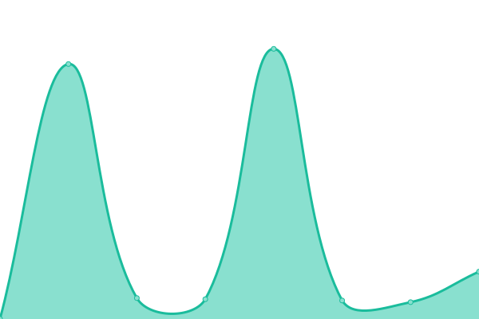 223ms
     
 | 

<a href="https://ravyshankar.github.io/cwp-status-uptime/history/pub">100.00%</a>
    

|  [COP Pavilion](www.cop-pavilion.gov.sg) | 🟩 Up | [cop-pavilion.yml](https://github.com/ravyshankar/cwp-status-uptime/commits/HEAD/history/cop-pavilion.yml) | 

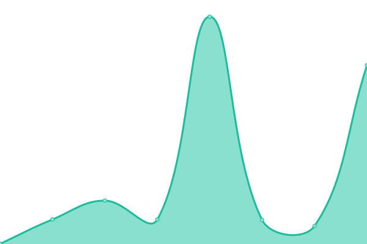 185ms
     
 | 

<a href="https://ravyshankar.github.io/cwp-status-uptime/history/cop-pavilion">100.00%</a>
    

|  [Make for Families](www.madeforfamilies.gov.sg) | 🟩 Up | [make-for-families.yml](https://github.com/ravyshankar/cwp-status-uptime/commits/HEAD/history/make-for-families.yml) | 

 354ms
     
 | 

<a href="https://ravyshankar.github.io/cwp-status-uptime/history/make-for-families">100.00%</a>
    

|  [PSD Challenge](psdchallenge.psd.gov.sg) | 🟩 Up | [psd-challenge.yml](https://github.com/ravyshankar/cwp-status-uptime/commits/HEAD/history/psd-challenge.yml) | 

 1015ms
     
 | 

<a href="https://ravyshankar.github.io/cwp-status-uptime/history/psd-challenge">100.00%</a>
    

|  [Caring Commuters](www.caringcommuters.gov.sg) | 🟩 Up | [caring-commuters.yml](https://github.com/ravyshankar/cwp-status-uptime/commits/HEAD/history/caring-commuters.yml) | 

 172ms
     
 | 

<a href="https://ravyshankar.github.io/cwp-status-uptime/history/caring-commuters">100.00%</a>
    

|  [URA](www.ura.gov.sg) | 🟩 Up | [ura.yml](https://github.com/ravyshankar/cwp-status-uptime/commits/HEAD/history/ura.yml) | 

 2743ms
     
 | 

<a href="https://ravyshankar.github.io/cwp-status-uptime/history/ura">98.81%</a>
    

|  [SIWW](www.siww.com.sg) | 🟩 Up | [siww.yml](https://github.com/ravyshankar/cwp-status-uptime/commits/HEAD/history/siww.yml) | 

 767ms
     
 | 

<a href="https://ravyshankar.github.io/cwp-status-uptime/history/siww">98.72%</a>
    

|  [Science Center](www.science.edu.sg) | 🟩 Up | [science-center.yml](https://github.com/ravyshankar/cwp-status-uptime/commits/HEAD/history/science-center.yml) | 

 173ms
     
 | 

<a href="https://ravyshankar.github.io/cwp-status-uptime/history/science-center">100.00%</a>
    

|  [SEAB](www.seab.gov.sg) | 🟩 Up | [seab.yml](https://github.com/ravyshankar/cwp-status-uptime/commits/HEAD/history/seab.yml) | 

 138ms
     
 | 

<a href="https://ravyshankar.github.io/cwp-status-uptime/history/seab">100.00%</a>
    

|  [SFA](www.sfa.gov.sg) | 🟩 Up | [sfa.yml](https://github.com/ravyshankar/cwp-status-uptime/commits/HEAD/history/sfa.yml) | 

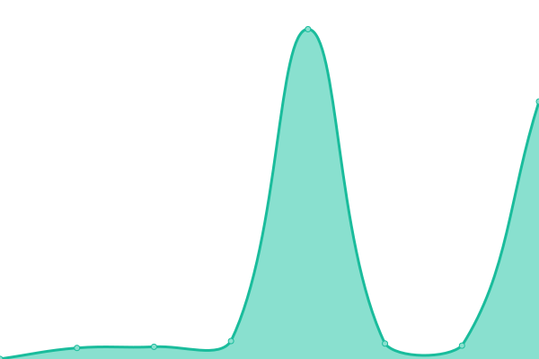 205ms
     
 | 

<a href="https://ravyshankar.github.io/cwp-status-uptime/history/sfa">100.00%</a>
    

|  [Skills Future](www.skillsfuture.gov.sg) | 🟩 Up | [skills-future.yml](https://github.com/ravyshankar/cwp-status-uptime/commits/HEAD/history/skills-future.yml) | 

 144ms
     
 | 

<a href="https://ravyshankar.github.io/cwp-status-uptime/history/skills-future">100.00%</a>
    

|  [TOTEBOARD](www.toteboard.gov.sg) | 🟩 Up | [toteboard.yml](https://github.com/ravyshankar/cwp-status-uptime/commits/HEAD/history/toteboard.yml) | 

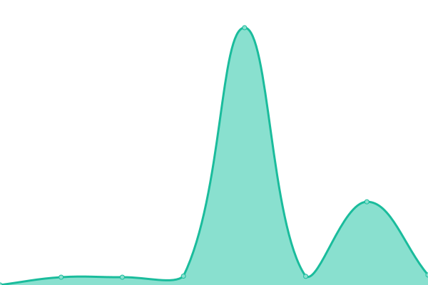 645ms
     
 | 

<a href="https://ravyshankar.github.io/cwp-status-uptime/history/toteboard">100.00%</a>
    

|  [Asean Geospatial](www.aseangeospatial.org) | 🟩 Up | [asean-geospatial.yml](https://github.com/ravyshankar/cwp-status-uptime/commits/HEAD/history/asean-geospatial.yml) | 

 205ms
     
 | 

<a href="https://ravyshankar.github.io/cwp-status-uptime/history/asean-geospatial">100.00%</a>
    

|  [WSG](www.wsg.gov.sg) | 🟩 Up | [wsg.yml](https://github.com/ravyshankar/cwp-status-uptime/commits/HEAD/history/wsg.yml) | 

 155ms
     
 | 

<a href="https://ravyshankar.github.io/cwp-status-uptime/history/wsg">100.00%</a>
    

|  [Content Careers Future](content.mycareersfuture.gov.sg) | 🟩 Up | [content-careers-future.yml](https://github.com/ravyshankar/cwp-status-uptime/commits/HEAD/history/content-careers-future.yml) | 

 505ms
     
 | 

<a href="https://ravyshankar.github.io/cwp-status-uptime/history/content-careers-future">100.00%</a>
    

|  [Yellow Ribbon](www.yellowribbon.gov.sg) | 🟩 Up | [yellow-ribbon.yml](https://github.com/ravyshankar/cwp-status-uptime/commits/HEAD/history/yellow-ribbon.yml) | 

 161ms
     
 | 

<a href="https://ravyshankar.github.io/cwp-status-uptime/history/yellow-ribbon">100.00%</a>
    

|  [NCPG](www.ncpg.org.sg) | 🟩 Up | [ncpg.yml](https://github.com/ravyshankar/cwp-status-uptime/commits/HEAD/history/ncpg.yml) | 

 146ms
     
 | 

<a href="https://ravyshankar.github.io/cwp-status-uptime/history/ncpg">100.00%</a>
    

|  [SGENABLE](www.sgenable.sg) | 🟩 Up | [sgenable.yml](https://github.com/ravyshankar/cwp-status-uptime/commits/HEAD/history/sgenable.yml) | 

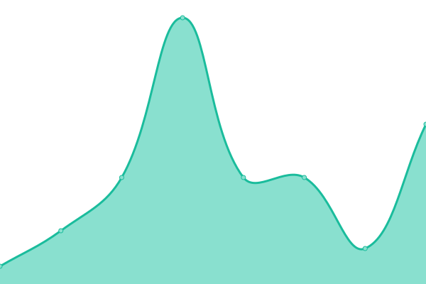 6ms
     
 | 

<a href="https://ravyshankar.github.io/cwp-status-uptime/history/sgenable">100.00%</a>
    

<!--end: status pages-->
