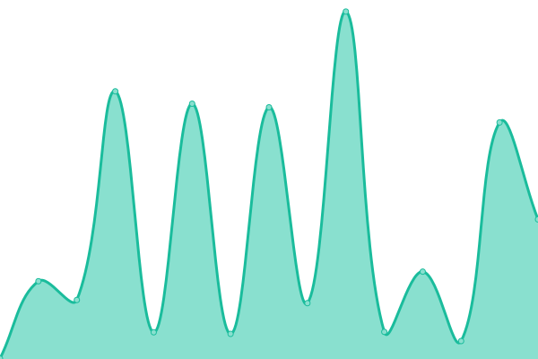

# [📈 Live Status](https://GovTech GDP.github.io/CWP-Websites-UpTime-Status): <!--live status--> **🟧 Partial outage**

This repository contains the open-source uptime monitor and status page for [GovTech GDP](https://GovTech GDP.github.io/CWP-Websites-UpTime-Status), powered by [Upptime](https://github.com/upptime/upptime).

With [Upptime](https://upptime.js.org), you can get your own unlimited and free uptime monitor and status page, powered entirely by a GitHub repository. We use [Issues](https://github.com/GovTech GDP/CWP-Websites-UpTime-Status/issues) as incident reports, [Actions](https://github.com/GovTech GDP/CWP-Websites-UpTime-Status/actions) as uptime monitors, and [Pages](https://GovTech GDP.github.io/CWP-Websites-UpTime-Status) for the status page.

<!--start: status pages-->
<!-- This summary is generated by Upptime (https://github.com/upptime/upptime) -->
<!-- Do not edit this manually, your changes will be overwritten -->
<!-- prettier-ignore -->
| URL | Status | History | Response Time | Uptime |
| --- | ------ | ------- | ------------- | ------ |
|  [MHA](https://www.mha.gov.sg) | 🟩 Up | [mha.yml](https://github.com/ravyshankar/cwp-status-uptime/commits/HEAD/history/mha.yml) | 

 234ms
     
 | 

<a href="https://GovTech GDP.github.io/CWP-Websites-UpTime-Status/history/mha">100.00%</a>
    

|  [ICA](https://www.ica.gov.sg) | 🟩 Up | [ica.yml](https://github.com/ravyshankar/cwp-status-uptime/commits/HEAD/history/ica.yml) | 

 267ms
     
 | 

<a href="https://GovTech GDP.github.io/CWP-Websites-UpTime-Status/history/ica">100.00%</a>
    

|  [MFA](https://www.mfa.gov.sg) | 🟩 Up | [mfa.yml](https://github.com/ravyshankar/cwp-status-uptime/commits/HEAD/history/mfa.yml) | 

 168ms
     
 | 

<a href="https://GovTech GDP.github.io/CWP-Websites-UpTime-Status/history/mfa">100.00%</a>
    

|  [NEA](https://www.nea.gov.sg) | 🟩 Up | [nea.yml](https://github.com/ravyshankar/cwp-status-uptime/commits/HEAD/history/nea.yml) | 

 756ms
     
 | 

<a href="https://GovTech GDP.github.io/CWP-Websites-UpTime-Status/history/nea">100.00%</a>
    

|  [SLA](https://moh.gov.sg) | 🟥 Down | [sla.yml](https://github.com/ravyshankar/cwp-status-uptime/commits/HEAD/history/sla.yml) | 

 0ms
     
 | 

<a href="https://GovTech GDP.github.io/CWP-Websites-UpTime-Status/history/sla">0.00%</a>
    

<!--end: status pages-->

[**Visit our status website →**](https://GovTech GDP.github.io/CWP-Websites-UpTime-Status)

## 📄 License

- Powered by: [Upptime](https://github.com/upptime/upptime)
- Code: [MIT](./LICENSE) © [Anand Chowdhary](https://anandchowdhary.com), supported by [Pabio](https://pabio.com)
- Data in the `./history` directory: [Open Database License](https://opendatacommons.org/licenses/odbl/1-0/)
